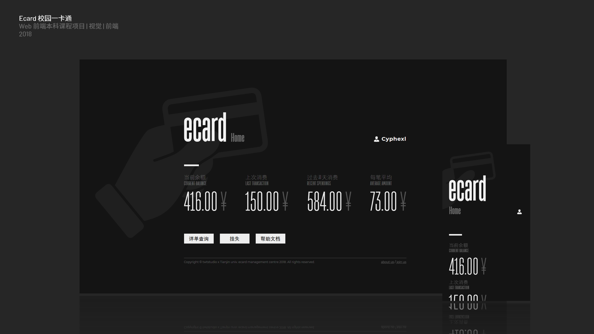

# Ecard - Web Development Course Project

### Background

天津大学（其前身为北洋大学），始建于 1895 年 10 月 2 日，是中国第一所现代大学。目前，学校有教职工 4000 余人、全日制在校生 30000 余人，并有食堂、超市等各类商家数十家。

每天，天津大学的在校师生都在和这些商家发生着各式各样的交易。校园内使用现有的一卡通系统进行日常的小笔金额交易和财务收支管理，其核心采用 Mifare NFC 技术进行即时数据交换，具有简单、即时、安全且无终端电量依赖等优点。然而，目前的校园一卡通管理终端只由散布在校园宿舍、食堂等场所的诸台固定设备登入，进行余额查询、流水查询和挂失解挂等工作，而缺少一个统一、通用的 Web 客户端。

在此背景下，天津大学天外天工作室同天津大学校园一卡通管理中心达成合作协议。一卡通管理中心为我们提供相关接口，天外天工作室将提供一个跨 Android / iOS / Web 三端的校园卡管理客户端。目前，该合作仅仅在意向谈成阶段，接口尚未被指定，开发工作可能还需一段时间正式开始。

作为天外天工作室的骨干成员，小组内成员决定模拟校园卡管理系统，开发目标为校园卡综合管理终端的 Web 项目。在开发过程中，将积累相应经验，提前制定需求、策划项目和熟悉业务流程，并计划将开发过程中的部分系统架构、视觉设计语言和业务逻辑代码应用于最终实际投入使用的工程中。

### 项目成员基本信息

|  姓名  |    学号    | GitHub commit 用户名 | 分工                |
| :----: | :--------: | :------------------: | ------------------- |
| 王惠民 | 3016218125 |        tjwhm         | 项目管理 / 后端开发 |
| 赵家琛 | 3016218106 |       uareagay       | 后端开发            |
| 周菁涛 | 3016218162 |       Cyphexl        | Front-end / UI / UX |
| 李志杰 | 3016218088 |      leezhijie       | 后端开发            |

